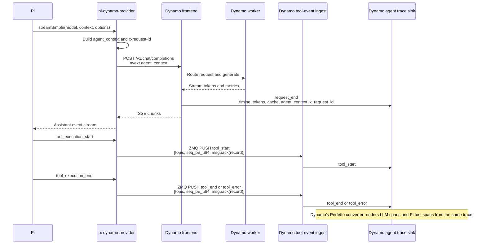
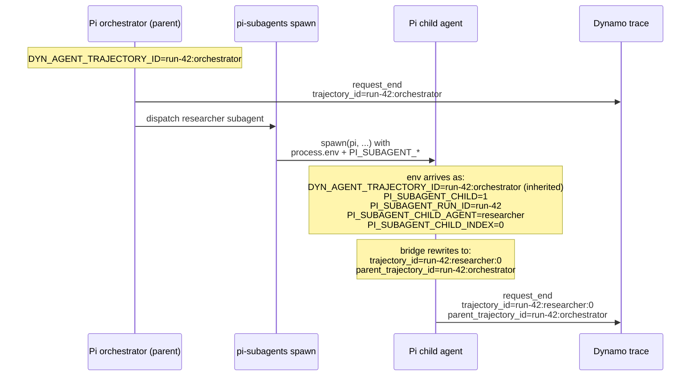

# pi-dynamo-provider

Pi extension package that registers a `dynamo` provider backed by Dynamo's OpenAI-compatible chat-completions endpoint.

It lets Pi use Dynamo as a normal model provider:

```bash
pi --model dynamo/<model-id>
```

The extension also injects Dynamo agent-context metadata on every LLM request and can relay Pi tool events into Dynamo's agent trace sink, so one Dynamo trace can show both LLM requests and Pi tool trajectories.

## What This Package Does

- Registers a Pi provider named `dynamo`.
- Discovers models from Dynamo's `/v1/models` endpoint.
- Delegates chat-completion streaming to Pi's existing OpenAI-compatible provider.
- Adds `nvext.agent_context` to each request payload.
- Adds `x-request-id` when the request does not already have one.
- Optionally sends Pi tool events to Dynamo over ZMQ:
  - `tool_start`
  - `tool_end`
  - `tool_error`
- Keeps this integration outside `pi-mono`; no Pi core patch is required.

Request and tool data flow:



## Install

From npm, after the package is published:

```bash
pi install npm:pi-dynamo-provider
```

From this GitHub repo:

```bash
pi install git:git@github.com:NVIDIA-dev/pi-dynamo-provider.git
```

For a project-local install that can be checked into `.pi/settings.json`, add `-l`:

```bash
pi install -l git:git@github.com:NVIDIA-dev/pi-dynamo-provider.git
```

For local development from a checkout:

```bash
git clone git@github.com:NVIDIA-dev/pi-dynamo-provider.git
cd pi-dynamo-provider
npm install
npm run build

pi install /absolute/path/to/pi-dynamo-provider
```

You can also try the extension for one run without installing it:

```bash
cd /absolute/path/to/pi-dynamo-provider
pi -e ./src/index.ts --model dynamo/<model-id>
```

## Quick Start

Start Dynamo with an OpenAI-compatible endpoint, then point Pi at it:

```bash
export DYNAMO_BASE_URL=http://127.0.0.1:8000/v1
export DYNAMO_API_KEY=dummy

pi --model dynamo/<model-id> -p "Reply exactly ok."
```

For local Dynamo, the API key is usually not checked. This package defaults to `dynamo-local` if `DYNAMO_API_KEY` is unset.

## Local Dynamo Launcher

For local onboarding, this repo includes two small Dynamo helper scripts.

First install Dynamo from the current mooncake replay branch:

```bash
./scripts/install-dynamo.sh
```

That script:

- clones Dynamo into `${XDG_CACHE_HOME:-$HOME/.cache}/pi-dynamo-provider/dynamo`;
- checks out `ishan/mooncake-replay-hashes` by default;
- creates `.venv` with `uv`;
- builds Dynamo Python bindings with `maturin develop --uv`;
- installs Dynamo with `uv pip install -e .`.

Then launch GLM-4.7-Flash:

```bash
./scripts/launch-agg-agent.sh
```

The launch script:

- serves `zai-org/GLM-4.7-Flash` by default;
- launches one Dynamo frontend plus one SGLang worker;
- defaults to one visible GPU, `CUDA_VISIBLE_DEVICES=0`, and `--tp 1`;
- uses file discovery, TCP request plane, and ZMQ event plane;
- does not require NATS or etcd;
- enables Dynamo JSONL agent tracing and Pi tool-event ingest.

After the model is ready, it prints the exact Pi env vars to use from another shell.

Common install overrides:

```bash
./scripts/install-dynamo.sh --workdir /ephemeral/pi-dynamo
./scripts/install-dynamo.sh --dynamo-dir /home/nvidia/dynamo
./scripts/install-dynamo.sh --dynamo-ref ishan/mooncake-replay-hashes
```

Common launch overrides:

```bash
# Pick a different single GPU.
./scripts/launch-agg-agent.sh --gpu 1

# Forward extra flags to dynamo.sglang.
./scripts/launch-agg-agent.sh -- --disable-cuda-graph
```

For one worker across multiple GPUs, expose those GPUs and match tensor parallelism:

```bash
./scripts/launch-agg-agent.sh --gpu 0,1 --tp 2
```

Use that form if GLM-4.7-Flash does not fit on one GPU.

## Dynamo Requirements

Minimum:

- Dynamo serves an OpenAI-compatible `/v1/chat/completions` endpoint.
- Dynamo serves `/v1/models`, or you are willing to use the fallback model id `dynamo/default`.
- Pi can reach `DYNAMO_BASE_URL` from the machine running Pi.

For request tracing:

- Dynamo agent tracing must be enabled.
- Pi requests must include `nvext.agent_context`, which this package injects.

For tool tracing:

- Dynamo must include the tool-event ingest/relay support.
- Dynamo binds the ZMQ PULL endpoint, and Pi connects a ZMQ PUSH socket to the same endpoint.
- Pi must run with tools enabled and execute at least one tool.

Dynamo owns the bind side so multiple Pi plugins, subagents, or tool worker processes can all connect as producers without competing to bind the same local endpoint.

Equivalent manual Dynamo launch shape:

```bash
cd ${XDG_CACHE_HOME:-$HOME/.cache}/pi-dynamo-provider/dynamo
source .venv/bin/activate

export CUDA_VISIBLE_DEVICES=0
export DYN_HTTP_PORT=18083
export DYN_DISCOVERY_BACKEND=file
export DYN_REQUEST_PLANE=tcp
export DYN_EVENT_PLANE=zmq
export DYN_FILE_KV=/tmp/dynamo-file-kv
export DYN_AGENT_TRACE_SINKS=jsonl
export DYN_AGENT_TRACE_OUTPUT_PATH=/tmp/dynamo-agent-trace.jsonl
export DYN_AGENT_TRACE_TOOL_EVENTS_ZMQ_ENDPOINT=tcp://127.0.0.1:20390

python3 -m dynamo.frontend \
  --discovery-backend file \
  --request-plane tcp \
  --event-plane zmq \
  --router-mode round-robin &

DYN_SYSTEM_PORT=18084 python3 -m dynamo.sglang \
  --discovery-backend file \
  --request-plane tcp \
  --event-plane zmq \
  --model-path zai-org/GLM-4.7-Flash \
  --served-model-name zai-org/GLM-4.7-Flash \
  --page-size 16 \
  --tp 1 \
  --trust-remote-code \
  --enable-streaming-session \
  --skip-tokenizer-init \
  --dyn-reasoning-parser glm45 \
  --dyn-tool-call-parser glm47 \
  --enable-metrics
```

Then run Pi:

```bash
export DYNAMO_BASE_URL=http://127.0.0.1:18083/v1
export DYNAMO_API_KEY=dummy

export DYN_AGENT_SESSION_TYPE_ID=pi_coding_agent
export DYN_AGENT_SESSION_ID=pi-demo-001
export DYN_AGENT_TOOL_EVENTS_ZMQ_ENDPOINT=tcp://127.0.0.1:20390

pi --model dynamo/zai-org/GLM-4.7-Flash \
  -p "Run the tests in this folder, fix the smallest bug, and rerun the tests."
```

## Model Names

Use Pi model names in this form:

```text
dynamo/<model-id-from-dynamo>
```

Examples:

```bash
pi --model dynamo/zai-org/GLM-4.7-Flash
pi --model dynamo/Qwen/Qwen3-32B
```

On startup, the extension calls:

```text
<DYNAMO_BASE_URL>/models
```

If model discovery fails, the extension still registers:

```text
dynamo/default
```

That fallback is useful for smoke tests against minimal OpenAI-compatible endpoints, but normal Dynamo runs should use the actual model id returned by `/v1/models`.

<details>
<summary>Pi-side environment variables</summary>

| Variable | Default | Purpose |
| --- | --- | --- |
| `DYNAMO_BASE_URL` | `http://127.0.0.1:8000/v1` | Dynamo OpenAI-compatible endpoint root. |
| `OPENAI_BASE_URL` | unset | Fallback endpoint root when `DYNAMO_BASE_URL` is unset. |
| `DYNAMO_API_KEY` | `dynamo-local` | Bearer token sent to Dynamo. Local Dynamo usually accepts a dummy value. |
| `DYN_AGENT_SESSION_TYPE_ID` | `pi_coding_agent` | Stable session type used by Dynamo traces/profilers. |
| `DYN_AGENT_SESSION_ID` | unset | Session/run id. If unset for tool events, the Pi session id is used. |
| `DYN_AGENT_TRAJECTORY_ID` | unset | Trajectory id override. If unset, Pi's session id is used per request. |
| `DYN_AGENT_PARENT_TRAJECTORY_ID` | unset | Optional parent trajectory id for nested/subagent workflows. |
| `DYN_AGENT_TOOL_EVENTS_ZMQ_ENDPOINT` | unset | Dynamo-bound ZMQ PULL endpoint Pi connects to for tool events. |
| `DYN_AGENT_TRACE_TOOL_ZMQ_ENDPOINT` | unset | Alias for the tool-event endpoint. |
| `DYN_AGENT_TRACE_TOOL_EVENTS_ZMQ_ENDPOINT` | unset | Alias for the tool-event endpoint. |
| `DYN_AGENT_TOOL_EVENTS_ZMQ_TOPIC` | `agent-tool-events` | ZMQ topic frame. |
| `DYN_AGENT_TRACE_TOOL_ZMQ_TOPIC` | unset | Alias for the tool-event topic. |
| `DYN_AGENT_TRACE_TOOL_EVENTS_ZMQ_TOPIC` | unset | Alias for the tool-event topic. |
| `DYN_AGENT_TOOL_EVENTS_QUEUE_CAPACITY` | `100000` | Local publish queue capacity before tool events are dropped. |
| `PI_SUBAGENT_CHILD` | unset | Read, not set: when `1`, the trajectory bridge rewrites `trajectory_id` / `parent_trajectory_id` from pi-subagents' bookkeeping vars. See [Subagent trajectory linking](#subagent-trajectory-linking). |
| `PI_SUBAGENT_RUN_ID` | unset | Read, not set: pi-subagents run identifier. Used by the trajectory bridge. |
| `PI_SUBAGENT_CHILD_AGENT` | unset | Read, not set: pi-subagents child-agent name. Used by the trajectory bridge. |
| `PI_SUBAGENT_CHILD_INDEX` | unset | Read, not set: pi-subagents sibling index. Used by the trajectory bridge; defaults to `0`. |

</details>

<details>
<summary>Dynamo-side environment variables</summary>

These are the Dynamo variables most commonly needed for Pi traces. Exact launch details can differ by Dynamo backend and branch.

| Variable | Example | Purpose |
| --- | --- | --- |
| `DYN_HTTP_PORT` | `18083` | Dynamo HTTP port for `/v1/models` and `/v1/chat/completions`. |
| `DYN_AGENT_TRACE_SINKS` | `jsonl` | Enables Dynamo agent trace sinks. |
| `DYN_AGENT_TRACE_OUTPUT_PATH` | `/tmp/dynamo-agent-trace.jsonl` | JSONL trace output path. |
| `DYN_AGENT_TRACE_JSONL_FLUSH_INTERVAL_MS` | `100` | Optional flush interval for faster interactive validation. |
| `DYN_AGENT_TRACE_TOOL_EVENTS_ZMQ_ENDPOINT` | `tcp://127.0.0.1:20390` | ZMQ PULL endpoint Dynamo binds for Pi tool events. |
| `DYN_DISCOVERY_BACKEND` | `file` | File-backed local discovery; avoids etcd. |
| `DYN_REQUEST_PLANE` | `tcp` | TCP request distribution from frontend to worker. |
| `DYN_EVENT_PLANE` | `zmq` | ZMQ local event plane; avoids NATS. |
| `DYN_FILE_KV` | `/tmp/dynamo-file-kv` | File discovery state directory. |

</details>

<details>
<summary>Injected request metadata</summary>

Every LLM request payload gets:

```json
{
  "nvext": {
    "agent_context": {
      "session_type_id": "pi_coding_agent",
      "session_id": "pi-demo-001",
      "trajectory_id": "<pi-session-id>",
      "parent_trajectory_id": "<optional-parent>",
      "phase": "reasoning"
    }
  }
}
```

The extension preserves existing `nvext` fields and existing `nvext.agent_context` fields. It also adds `x-request-id` if the caller did not already set one.

</details>

<details>
<summary>Tool-event wire format</summary>

When `DYN_AGENT_TOOL_EVENTS_ZMQ_ENDPOINT` or one of its aliases is configured, Pi connects a ZMQ PUSH socket and sends one multipart message per tool event:

```text
[topic, seq_be_u64, msgpack(AgentTraceRecord)]
```

The decoded `AgentTraceRecord` uses Dynamo's agent trace schema:

```json
{
  "schema": "dynamo.agent.trace.v1",
  "event_type": "tool_end",
  "event_time_unix_ms": 1777915663000,
  "event_source": "harness",
  "agent_context": {
    "session_type_id": "pi_coding_agent",
    "session_id": "pi-demo-001",
    "trajectory_id": "<pi-session-id>"
  },
  "tool": {
    "tool_call_id": "<pi-tool-call-id>",
    "tool_class": "bash",
    "started_at_unix_ms": 1777915662000,
    "ended_at_unix_ms": 1777915663000,
    "duration_ms": 1000,
    "status": "succeeded",
    "output_bytes": 1234
  }
}
```

Terminal `tool_end` and `tool_error` records include enough timing information to render a span even if a consumer missed the corresponding `tool_start`.

</details>

## Subagent trajectory linking

When Pi runs with [pi-subagents](https://github.com/nicobailon/pi-subagents) and dispatches a child agent, the child agent runs as a separate Node process. Pi-subagents already passes its parent's `process.env` through to the child, which means the parent's `DYN_AGENT_TRAJECTORY_ID` arrives in the child's environment unchanged — under the wrong name. Without intervention, both the parent and the child would emit identical `trajectory_id` values to Dynamo, collapsing the parent/child distinction in the trace.

This package detects that pattern and rewrites the trajectory ids automatically. When `PI_SUBAGENT_CHILD=1` is present in the child's environment (set by pi-subagents on every spawn), the inherited `DYN_AGENT_TRAJECTORY_ID` is reinterpreted as the parent's id, and the child's id is synthesized deterministically from `PI_SUBAGENT_RUN_ID:PI_SUBAGENT_CHILD_AGENT:PI_SUBAGENT_CHILD_INDEX`.



### What you need to do

For top-level Pi runs that you expect to spawn subagents, give the orchestrator a stable trajectory id so subagents can reference it:

```bash
export DYN_AGENT_SESSION_TYPE_ID=pi_coding_agent
export DYN_AGENT_SESSION_ID="run-$(date +%s)"
export DYN_AGENT_TRAJECTORY_ID="${DYN_AGENT_SESSION_ID}:orchestrator"

pi --model dynamo/<model-id> -p "..."
```

One caveat: pi-subagents does not currently thread the parent's `--model` down to child Pi processes, so children fall through to Pi's default model resolution, which usually isn't Dynamo. The bridge still rewrites the trajectory id, but the LLM call never reaches Dynamo and no child trace record is written. Make Dynamo the saved default in `~/.pi/agent/settings.json` so children pick it up:

```json
{
  "defaultProvider": "dynamo",
  "defaultModel": "zai-org/GLM-4.7-Flash"
}
```

(The settings key is `defaultModel`, not `defaultModelId`. Alternatively, pin `model: dynamo/<model-id>` in the frontmatter of each pi-subagents agent's `.md`.)

When pi-subagents spawns a child, the bridge fires automatically — no extra plumbing on the pi-subagents side, and no modifications to your subagent prompts. Trace records emitted by the child will carry `parent_trajectory_id` set to the orchestrator's id, and offline tooling can reconstruct the agent tree from the `(session_id, trajectory_id, parent_trajectory_id)` triple alone.

### Behavior summary

| Situation | trajectory_id emitted | parent_trajectory_id emitted |
| --- | --- | --- |
| Top-level Pi (no pi-subagents) | from `DYN_AGENT_TRAJECTORY_ID` (or Pi session id) | from `DYN_AGENT_PARENT_TRAJECTORY_ID` (usually unset) |
| pi-subagents child, default | `<RUN_ID>:<CHILD_AGENT>:<CHILD_INDEX>` | parent's `DYN_AGENT_TRAJECTORY_ID` (inherited) |
| pi-subagents child, with explicit `DYN_AGENT_PARENT_TRAJECTORY_ID` set | unchanged from explicit value | unchanged from explicit value |
| pi-subagents child with incomplete bookkeeping vars | falls back to top-level behavior | falls back to top-level behavior |

The bridge only fires when all three of `PI_SUBAGENT_CHILD=1`, `PI_SUBAGENT_RUN_ID`, and `PI_SUBAGENT_CHILD_AGENT` are present and `DYN_AGENT_PARENT_TRAJECTORY_ID` is not already set; manual overrides always win.

### Verifying the link

After a run with subagents, decompress the Dynamo trace and group by trajectory id:

```bash
zcat /tmp/dynamo-agent-trace.*.jsonl.gz \
  | jq -c '.event | select(.event_type=="request_end") | {trajectory_id: .agent_context.trajectory_id, parent_trajectory_id: .agent_context.parent_trajectory_id, request_id: .request.request_id}'
```

You should see `parent_trajectory_id` populated on every child trajectory's records, with the orchestrator's records having it unset (the orchestrator is its own root unless an outer wrapper provides one).

## Generate Perfetto

After a run, convert the Dynamo JSONL trace:

```bash
cd /home/nvidia/dynamo
source .venv/bin/activate

python benchmarks/agent_trace/convert_to_perfetto.py \
  /tmp/dynamo-agent-trace.jsonl \
  --include-markers \
  --separate-stage-tracks \
  --output /tmp/dynamo-agent-trace.perfetto.json
```

Open the generated JSON in Perfetto UI:

```text
https://ui.perfetto.dev
```

Expected trace shape:

- `dynamo.llm` spans for LLM requests.
- `dynamo.llm.stage` spans for prefill/decode stages when Dynamo records them.
- `dynamo.agent.tool` spans for Pi tools when ZMQ tool relay is enabled.

## Development

```bash
npm install
npm run check
npm run test
npm run build
```

Run from source without installing:

```bash
export DYNAMO_BASE_URL=http://127.0.0.1:8000/v1
pi -e ./src/index.ts --model dynamo/<model-id>
```

## Continuous integration

`.github/workflows/integration-smoke.yml` runs an end-to-end check that `nvext.agent_context` fields emitted by this package round-trip through Dynamo's actual frontend + mocker into the agent trace JSONL. Builds Dynamo from `ai-dynamo/dynamo@main` on every run — published wheels lag behind the agent trace sink surface this package depends on, so we need source builds. Cargo cache keeps warm runs in the ~60-90s range; cold runs ~10 min.

The smoke test exercises two cases:

1. Top-level `agent_context` (`session_type_id`, `session_id`, `trajectory_id`) round-trips into the trace record verbatim.
2. With `PI_SUBAGENT_CHILD=1` + bookkeeping vars exported, `readDynamoConfig` rewrites `trajectory_id` / `parent_trajectory_id` and the rewritten values land in the trace.

Mocker output text is intentionally garbage — the harness never asserts on response content, only on the trace envelope. Manual `workflow_dispatch` accepts a `dynamo_ref` input for ad-hoc validation against a specific branch, tag, or SHA.

Run locally against an existing Dynamo install:

```bash
./scripts/integration-smoke.sh
```

## Troubleshooting

`/v1/models` is empty:

- Wait for the Dynamo backend to finish loading.
- Check Dynamo logs for worker registration failures.
- For local onboarding, make sure frontend and worker use the same `DYN_DISCOVERY_BACKEND=file`, `DYN_REQUEST_PLANE=tcp`, `DYN_EVENT_PLANE=zmq`, and `DYN_FILE_KV`.

Pi says the model is unknown:

- Run `curl -s "$DYNAMO_BASE_URL/models"` and use the returned id as `dynamo/<id>`.
- If discovery failed during Pi startup, restart Pi after Dynamo is ready.

LLM traces exist but tool spans are missing:

- Set `DYN_AGENT_TRACE_TOOL_EVENTS_ZMQ_ENDPOINT` on Dynamo.
- Set `DYN_AGENT_TOOL_EVENTS_ZMQ_ENDPOINT` to the same endpoint on Pi.
- Confirm the Pi run actually used tools.

Tool spans exist but request spans do not:

- Enable Dynamo tracing with `DYN_AGENT_TRACE_SINKS=jsonl`.
- Set `DYN_AGENT_TRACE_OUTPUT_PATH`.
- Confirm the request reached Dynamo's `/v1/chat/completions` endpoint.

Authentication fails:

- Set `DYNAMO_API_KEY` to the token expected by your Dynamo deployment.
- For local Dynamo, `DYNAMO_API_KEY=dummy` is usually sufficient.

## Current Scope

Included:

- OpenAI-compatible chat-completions path.
- Model discovery from `/v1/models`.
- Dynamo request metadata injection.
- Pi session id as default `trajectory_id`.
- Optional ZMQ tool-event relay into Dynamo traces.
- Perfetto-compatible trace output through Dynamo's converter.

Not included:

- No `pi-mono` core changes.
- No native Rust Pi extension ABI. A Rust implementation would still need a TypeScript/JavaScript package entrypoint, for example through N-API.
- No automatic Dynamo launch management.
- No automatic Perfetto upload or viewer hosting.
